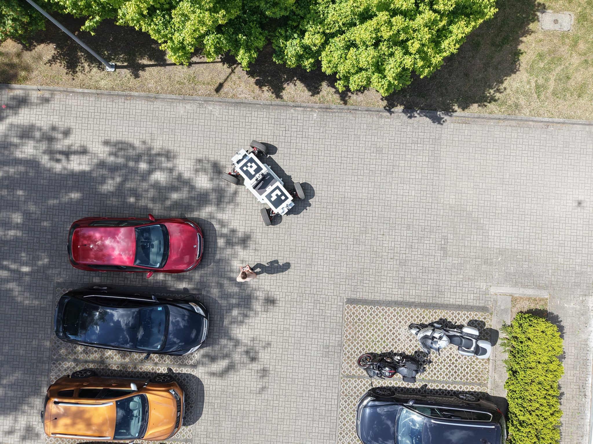
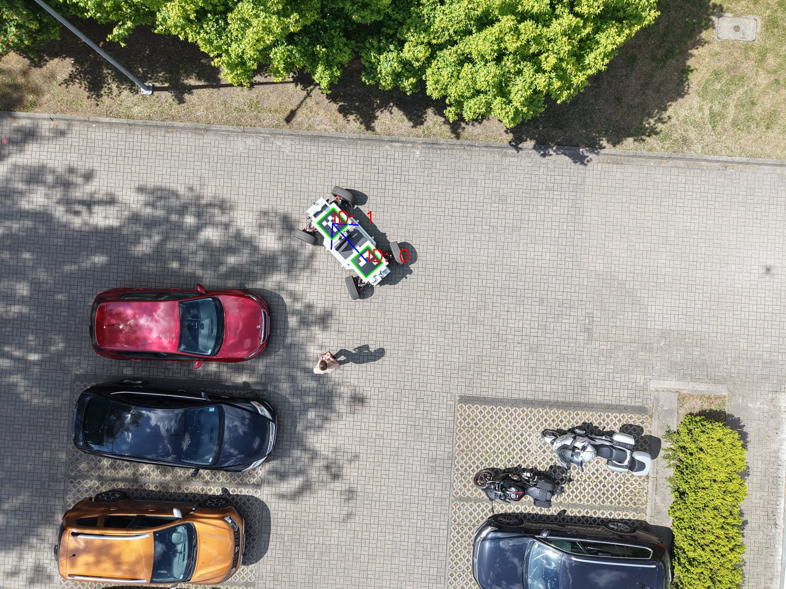

# ArucoDetection
Celem projektu jest wykrywanie znaczników ArUco znajdujących się na pojeździe. Dodatkowo po wykryciu dwóch zanczników określana jest orientacja pojazdu. Poniżej zaprezentowano działanie programu. Wynik działania programu dla całej bazy: [Pobierz z Google Drive](https://drive.google.com/drive/folders/1o57acqhOqQ_RHorSwbL1nPxljyvJVrgW?usp=drive_link)
 
  
  ## Wyniki
  
  |                   | 01_loop | 02_loop | 03_loop | 04_loop | 05_loop | 06_loop | 07_loop | 08_loop | 09_loop | Razem |
|---------------------------|--------:|--------:|--------:|--------:|--------:|--------:|--------:|--------:|--------:|------:|
| liczba zdjęć                 |      48 |      36 |      39 |      37 |      39 |      36 |      36 |      35 |      38 |   344 |
| wykrycie 1 znacznika                |      15 |       5 |       6 |       6 |       4 |       6 |       7 |      13 |       9 |    71 |
| wykrycie 2 znaczników               |      30 |      31 |      28 |      17 |       5 |       6 |       8 |      13 |      17 |   155 |
| brak wykrycia            |       3 |       0 |       5 |      14 |      30 |      24 |      21 |       9 |      12 |   118 |
| wykrycie co najmniej 1 znacznika    |      45 |      36 |      34 |      23 |       9 |      12 |      15 |      26 |      26 |   226 |
| % wykrycia 2 znaczników    |  62,50% |  86,11% |  71,79% |  45,95% |  12,82% |  16,67% |  22,22% |  37,14% |  44,74% | 45,06% |
| % wykrycia co najmniej 1 znacznika  |  93,75% | 100,00% |  87,18% |  62,16% |  23,08% |  33,33% |  41,67% |  74,29% |  68,42% | 65,70% |

